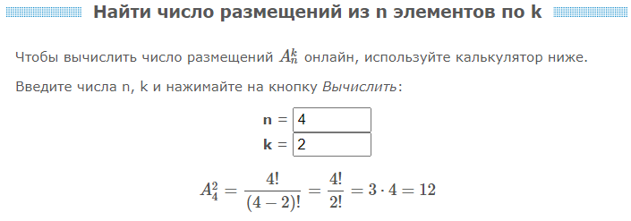

# iperf 
Тестирование ширины канала сетевых соединений между серверами группы серверов. Позволяет определить соответствие пропускной способности сетевых интерфейсов. Рекомендуется перед развёртыванием кластеров.

## Тест на сетевых интерфейсах 10GbE. 
Пример нормального канала (9.42 Gbits/sec) и пример канала со сбоями (111 Mbits/sec).

<pre><code>[user1@pg-1 ~]$ iperf3 -c 192.168.235.52 -i 1 -t 20 -P 4
Connecting to host 192.168.235.52, port 5201
[  4] local 192.168.235.55 port 47160 connected to 192.168.235.52 port 5201
[  6] local 192.168.235.55 port 47162 connected to 192.168.235.52 port 5201
[  8] local 192.168.235.55 port 47164 connected to 192.168.235.52 port 5201
[ 10] local 192.168.235.55 port 47166 connected to 192.168.235.52 port 5201
- - - - - - - - - - - - - - - - - - - - - - - - -
[ ID] Interval           Transfer     Bandwidth       Retr
[  4]   0.00-20.00  sec  3.66 GBytes  1.57 Gbits/sec    0             sender
[  4]   0.00-20.00  sec  3.65 GBytes  1.57 Gbits/sec                  receiver
[  6]   0.00-20.00  sec  3.66 GBytes  1.57 Gbits/sec    0             sender
[  6]   0.00-20.00  sec  3.65 GBytes  1.57 Gbits/sec                  receiver
[  8]   0.00-20.00  sec  3.66 GBytes  1.57 Gbits/sec    0             sender
[  8]   0.00-20.00  sec  3.65 GBytes  1.57 Gbits/sec                  receiver
[ 10]   0.00-20.00  sec  11.0 GBytes  4.71 Gbits/sec    0             sender
[ 10]   0.00-20.00  sec  11.0 GBytes  4.71 Gbits/sec                  receiver
[SUM]   0.00-20.00  sec  21.9 GBytes  9.42 Gbits/sec    0             sender
[SUM]   0.00-20.00  sec  21.9 GBytes  9.42 Gbits/sec                  receiver
iperf Done.

[user1@pg-2 ~]$ iperf3 -c 192.168.235.52 -i 1 -t 20 -P 4
Connecting to host 192.168.235.52, port 5201
[  4] local 192.168.235.56 port 33842 connected to 192.168.235.52 port 5201
[  6] local 192.168.235.56 port 33844 connected to 192.168.235.52 port 5201
[  8] local 192.168.235.56 port 33846 connected to 192.168.235.52 port 5201
[ 10] local 192.168.235.56 port 33848 connected to 192.168.235.52 port 5201
- - - - - - - - - - - - - - - - - - - - - - - - -
[ ID] Interval           Transfer     Bandwidth       Retr
[  4]   0.00-20.00  sec  79.4 MBytes  33.3 Mbits/sec  2085             sender
[  4]   0.00-20.00  sec  79.2 MBytes  33.2 Mbits/sec                  receiver
[  6]   0.00-20.00  sec  64.4 MBytes  27.0 Mbits/sec  1388             sender
[  6]   0.00-20.00  sec  63.9 MBytes  26.8 Mbits/sec                  receiver
[  8]   0.00-20.00  sec  59.1 MBytes  24.8 Mbits/sec  1448             sender
[  8]   0.00-20.00  sec  58.8 MBytes  24.7 Mbits/sec                  receiver
[ 10]   0.00-20.00  sec  62.6 MBytes  26.2 Mbits/sec  1331             sender
[ 10]   0.00-20.00  sec  62.4 MBytes  26.2 Mbits/sec                  receiver
[SUM]   0.00-20.00  sec   266 MBytes   111 Mbits/sec  6252             sender
[SUM]   0.00-20.00  sec   264 MBytes   111 Mbits/sec                  receiver
iperf Done.
</code></pre>

Тестирование и вывод результата в одну строчку.

<pre><code>root@u20d1h1:~# iperf3 -c u20d1h2 -i 1 -t 20 -P 4 --json | jq '.end.sum_sent.bits_per_second,.end.sum_received.bits_per_second' | tr "\n" " " | ts "$(hostname) u20d1h2"
u20d1h1 u20d1h2 9646248716.601824 9634273378.841862
</code></pre>

## Тест с помощью ansible. 

Тестирование всех серверов в inv_hosts

<pre><code>ansible iperf -i inv_hosts -m ping
ansible-playbook -i inv_hosts test.yml
</code></pre>

В результате в выводе получаем все пары серверов из inv_hosts
и тест ширины каналов между ними в битах/секунду.

<pre><code>TASK [iperf-test : debug] ***********************************************************************************************************************************************************
ok: [u20d1h1] => {
    "msg": [
        [
            "u20d1h1 u20d1h1 25621565623.727123 25620675369.667908 "
        ],
        [
            "u20d1h1 u20d1h2 4831341908.725933 4825646178.061866 "
        ],
        [
            "u20d1h1 u20d1h3 3201304362.408509 3199906393.8138833 "
        ],
        [
            "u20d1h1 u20d1h4 4436621068.830131 4432061596.594277 "
        ],
        [
            "u20d1h1 u16d1h5 1224094451.5424824 1223652322.8779948 "
        ]
    ]
}
ok: [u20d1h2] => {
    "msg": [
        [
            "u20d1h2 u20d1h1 5008578806.690671 5000055831.807937 "
        ],
        [
            "u20d1h2 u20d1h2 11838949053.39089 11834968415.277672 "
        ],
        [
            "u20d1h2 u20d1h3 4367331683.864591 4350918662.6426 "
        ],
        [
            "u20d1h2 u20d1h4 1276129542.0341218 1271024594.5737069 "
        ],
        [
            "u20d1h2 u16d1h5 1443583081.8688695 1440530083.3895059 "
        ]
    ]
}
ok: [u20d1h3] => {
    "msg": [
        [
            "u20d1h3 u20d1h1 2773226220.8389707 2769045907.7360206 "
        ],
        [
            "u20d1h3 u20d1h2 4174034570.7560215 4168296462.510731 "
        ],
        [
            "u20d1h3 u20d1h3 8176049373.263153 8174524989.612199 "
        ],
        [
            "u20d1h3 u20d1h4 2653492694.918465 2647392573.8271317 "
        ],
        [
            "u20d1h3 u16d1h5 1700743903.9431248 1695345140.3150837 "
        ]
    ]
}
ok: [u20d1h4] => {
    "msg": [
        [
            "u20d1h4 u20d1h1 2555148756.2680955 2554787211.1401367 "
        ],
        [
            "u20d1h4 u20d1h2 4133467023.8901896 4126286054.9333344 "
        ],
        [
            "u20d1h4 u20d1h3 5827905646.019906 5823375442.368512 "
        ],
        [
            "u20d1h4 u20d1h4 7131320556.101698 7130967249.902914 "
        ],
        [
            "u20d1h4 u16d1h5 8663198478.940002 8657523702.363314 "
        ]
    ]
}
ok: [u16d1h5] => {
    "msg": [
        [
            "u16d1h5 u20d1h1 3019690000 3008777000 "
        ],
        [
            "u16d1h5 u20d1h2 1942905000 1937275000 "
        ],
        [
            "u16d1h5 u20d1h3 7627938000 7622695000 "
        ],
        [
            "u16d1h5 u20d1h4 3001929000 2988682000 "
        ],
        [
            "u16d1h5 u16d1h5 27245580000 27231780000 "
        ]
    ]
}
Friday 27 January 2023  11:16:51 +0300 (0:00:00.157)       0:04:12.077 ******** 

# Здесь результаты не очень хорошие, т.к. тест проводился на виртуальных машинах которые крутились на одном хосте и CPU был перегружен.
</code></pre>

## Немного подсчётов.

При наличии 2-х - 3-х серверов можно протестировать вручную. 
При большем количестве вспоминаем формулу числа размещений (т.к. прядок важен):

https://www.matburo.ru/tvart_sub.php?p=calc_A

Так что лучше поручить тестирование какой-нибудь программе. Например, ansible.

# P.S. 
https://vuzlit.com/2250166/postanovka_zadachi 
Недостатки протокола TCP

https://ru.wikipedia.org/wiki/Медленный_старт 
Медленный старт — часть стратегии управления окном перегрузки (англ. congestion window), в TCP. Медленный старт используется совместно с другими алгоритмами для того чтобы избежать отправки большего количества данных, чем сеть способна передать. Алгоритм определяется RFC 5681.

https://habr.com/ru/company/webo/blog/327050/ 
Медленный старт мало влияет на скачивание крупных файлов или потокового видео, поскольку клиент и сервер достигнут максимальных значений окна перегрузки за несколько десятков или сотен миллисекунд, но это будет одним TCP-соединением.
Однако для многих HTTP-запросов, когда целевой файл относительно небольшой, передача может закончиться до того, как достигнут максимум окна перегрузки. То есть производительность веб-приложений зачастую ограничена временем круговой задержкой между сервером и клиентом.

https://habr.com/post/147747/ 
Повышаем скорость и качество работы сети, страдающей потерей пакетов.

